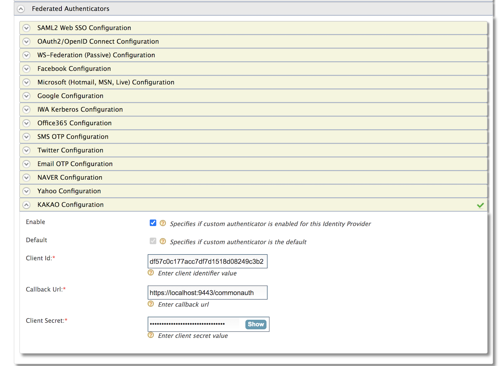

# Configuring Kakao Authenticator

This page provides instructions on how to configure the Kakao 
authenticator and the WSO2 Identity Server using a sample app to 
demonstrate authentication.

>The Kakao Authenticator is supported from WSO2 Identity Server 5.10.0 onwards.

Follow the steps given below to set this up.

* [Step 1 - Configure the Kakao App](#step-1---configure-the-kakao-app)
* [Step 2 - Deploy the Pickup Dispatch Sample Web App](#step-2---deploy-the-pickup-dispatch-sample-web-app)
* [Step 3 - Configure the Identity Provider (IdP)](#step-3---configure-the-identity-provider-idp)
* [Step 4 - Configure the Service Provider](#step-4---configure-the-service-provider)
* [Step 5 - Test the Sample Application](#step-5---test-the-sample-application)

## Step 1 - Configure the Kakao App

1. Place the kakao authenticator.jar file into the 
`<IS_HOME>/repository/components/dropins` directory. 
You can download the .jar file 
(``) 
from the [WSO2 Store](https://store.wso2.com/store/assets/isconnector/). 

2. Place the oauth2 generic authenticator.jar file into the 
 `<IS_HOME>/repository/components/lib` directory. 
 You can download the .jar file 
 (``) 
 from the [WSO2 Store](https://store.wso2.com/store/assets/isconnector/). 
 Next, start or restart the WSO2 Identity Server. 
     > :information_source: If you want to upgrade the Naver (.jar) in your existing Identity Server pack, 
 please refer [upgrade instructions](https://docs.wso2.com/display/ISCONNECTORS/Upgrading+an+Authenticator).
  
3. Sign up to Kakao using the following URL : `https://accounts.kakao.com/login?continue=https%3A%2F%2Fdevelopers
  .kakao.com%2Flogin%3Fcontinue%3D%252Fconsole%252Fapp`
  (If you are already existing user neglect this step)
  
4. Create a new application as described below.
 
    a. Navigate to the following URL: `https://developers.kakao.com/console/app`
    
    b. Click on Add Application
    
    c. Enter the required details.
    
        * App Name and Company details. 
        * Upload an image that you wish to use as the company logo.
        
    d. Click on **Save**. You will be redirect to the home page with the list of registered applications.
    
     
       
    e. Click on the newly created application. 
    
    d. When you click on the app you will get **REST API Key**. This can be used as the **Client ID**
    when configuring the authenticator in the WSO2 IAM. 
    
    e. Navigate to the **Kakao Login** tab and activate the application. Also add the callback URL to that application.
    
    f. Navigate to the **Security** tab and copy the **Client Secret**.
    
    
## Step 2 - Deploy the Pickup Dispatch Sample Web App

The next step is to deploy the Pickup Dispatch sample web app in order to use it in this scenario.

To configure this, see [saml2-web-app-pickup-dispatch 
webapp](https://is.docs.wso2.com/en/5.9.0/learn/deploying-the-sample-app/#deploying-the-saml2-web-app-pickup-dispatch-webapp).

## Step 3 - Configure the Identity Provider (IdP)

Next, add a new identity provider in WSO2 Identity Server, which was started in step 01 by [adding a new identity 
provider](https://is.docs.wso2.com/en/5.9.0/learn/adding-and-configuring-an-identity-provider/#adding-and-configuring-an-identity-provider).

1. Log in to the [Management Console](https://is.docs.wso2.com/en/5.9.0/setup/getting-started-with-the-management-console/) 
as an administrator.

2. In the **Identity Providers** section under the **Main** tab of the management console, click **Add**.

3. Enter a suitable name as the **Identity Provider Name** (e.g., Kakao).
    >As our resident Identity Provider is
 WSO2 IS, the Alias will appear as follows - `https://(host-name):(port)/oauth2/token`
   
4. Navigate to the **KAKAO Authenticator Configurations** under **Federated Authenticators**.

5. Enter the IdP related details as follows.

    <table>
    <thead>
    <tr class="header">
    <th>Field</th>
    <th>Description</th>
    <th>Sample Value</th>
    </tr>
    </thead>
    <tbody>
    <tr class="odd">
    <td>Enable</td>
    <td>Selecting this option enables Kakao to be used as an authenticator for users provisioned to the Identity
     Server.</td>
    <td>Selected</td>
    </tr>
    <tr class="even">
    <td>Default</td>
    <td>Selecting the Default checkbox signifies that Kakao is the main/default form of authentication. 
    This removes the selection made for any other Default checkboxes for other authenticators.</td>
    <td>Selected</td>
    </tr>
    <tr class="odd">
    <td>Client Id</td>
    <td>This is a unique public identifier for apps which is usually given as a 32-character hex string. 
    Enter the client ID of the app that you created in Kakao.</td>
    <td>81b05d91toz66e</td>
    </tr>
    <tr class="even">
    <td>Client Secret</td>
    <td>This is a secret known only to the application and the authorization server. Enter the  client ID  of the 
    app that you created in Kakao.</td>
    <td>otYR21HMW1PchfwZ</td>
    </tr>
    <tr class="odd">
    <td>Callback URL</td>
    <td>This is the URL to which the browser should be redirected after the authentication is successful. 
    It should have this format: https://(host-name):(port)/commonauth</td>
    <td>https://localhost:9443/commonauth</td>
    </tr>
    </tbody>
    </table>
    
    
    
7. Click on **Register**.

You have now added the identity provider.

## Step 4 - Configure the Service Provider

The next step is to configure the service provider on the WSO2 Identity Server.

> Edit the service provider you created in Step 2 and do the following configurations.

1. Return to the management console.

2. In the **Service Providers** section under the **Main** tab, click **Add**.

3. As you are using **saml2-web-app-pickup-dispatch** as the sample, enter **saml2-web-app-pickup-dispatch.com** in the **Service Provider
 Name** text box and click **Register**.

4. In the **Inbound Authentication Configuration** section, click **SAML2 Web SSO Configuration**, and then click **Configure**.

5. Add the service provider details as follows.
    
    a. Select Mode: Manual Configuration
       
      > For more information on the SAML2 Web Single-Sign-On Configuration methods, see [Configuring SAML2 Web Single
       -Sign-On](https://is.docs.wso2.com/en/latest/learn/configuring-single-sign-on-saml/) in the WSO2 IS 5.9.0
       guide.
    
    b. Issuer: saml2-web-app-pickup-dispatch
    
    c. Assertion Consumer URL: Enter `http://localhost.com:8080/saml2-web-app-pickup-dispatch.com/home.jsp` and click
     **Add**.
    
    d. Select the following check-boxes.
    
        * Enable Response Signing.
        * Enable Single Logout.
        * Enable Attribute Profile.
        * Include Attributes in the Response Always.
    
    
    
    e. Click **Register** to save the changes. Now you will be sent back to the **Service Providers** page.
    
    f. Go to the **Local and Outbound Authentication Configuration** section.
    
    g. Configure the Local and Outbound Authentication for Kakao.
    
    > For more information, see Configuring [Local and Outbound Authentication for a Service 
    Provider](https://is.docs.wso2.com/en/latest/learn/configuring-local-and-outbound-authentication-for-a-service
                                                                                                                                                                                                                                                                                                                                                                                                                                                                                                                                                                                                                                                                                                                                                                                                                                                                                                                                                                                                                                                                                                                                        >-provider/) 
    in the WSO2 Identity 5.10.0 guide.

        I. Click on the **Federated Authentication** radio button.
        II. Select the identity provider you created from the drop-down list under **Federated Authentication**. 
        III. Select the following options.
            * Use tenant domain in local subject identifier.
            * Use user store domain in local subject identifier.
            
    
            
    h. Click **Update** to save the changes.
    

## Step 5 - Test the Sample Application

1. To test the sample, go to the following URL: 
`http://<TOMCAT_HOST>:<TOMCAT_PORT>/saml2-web-app-pickup-dispatch.com/index.jsp`.
    
    Example: `http://localhost:8080/saml2-web-app-pickup-dispatch.com/index.jsp`
    
    

2. Click the link to log in with SAML from WSO2 Identity Server. You can use either the **Redirect Binding** or the **Post
 Binding** option.
 
3. You will be redirected to the Kakao sign in page. Enter your Kakao credentials.

    
    
4. Give the permission to the created kakao application to access the Kakaos account and get the required claims.

5. Give the consents to get the displayed claims to WSO2 Identity Server and Approve it.
    
6. After you are successfully authenticated, you will be taken to the home page of the saml2-web-app-pickup-dispatch.com
 app.

    