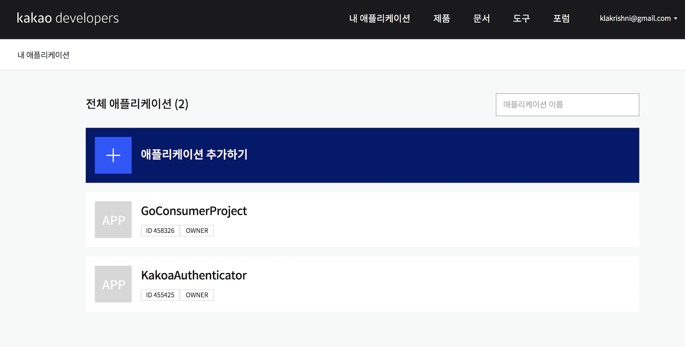
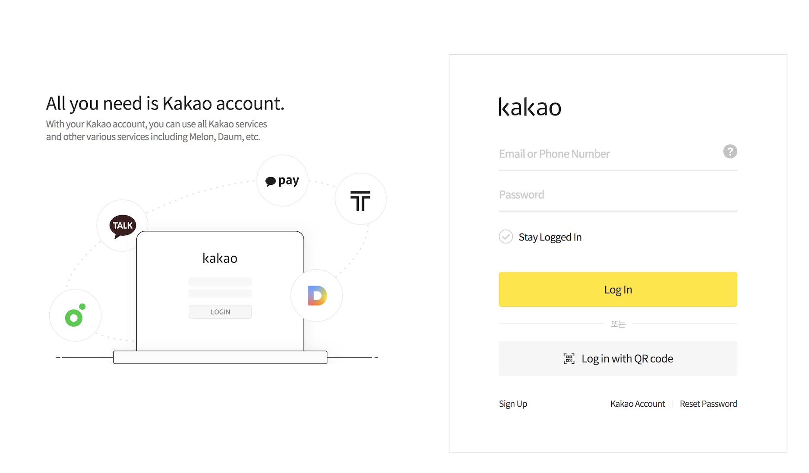

# Configuring Kakao Authenticator with IS 7.1

This page provides instructions on how to configure the Kakao
authenticator and the WSO2 Identity Server using a sample app to
demonstrate authentication. If you are using a IS version older than IS 7.0.0 please follow this [document](https://github.com/wso2-extensions/identity-outbound-auth-kakao/blob/master/docs/README.md).

Follow the steps given below to set this up.

* [Step 1 - Configure the Kakao App](#step-1---configure-the-kakao-app)
* [Step 2 - Deploy the Pickup Dispatch Sample Web App](#step-2---deploy-the-pickup-dispatch-sample-web-app)
* [Step 3 - Configure the Identity Provider (IdP)](#step-3---configure-the-identity-provider-idp)
* [Step 4 - Configure the Service Provider](#step-4---configure-the-service-provider)
* [Step 5 - Test the Sample Application](#step-5---test-the-sample-application)

## Step 1 - Configure the Kakao App

1. Place the kakao authenticator.jar file into the
   `<IS_HOME>/repository/components/dropins` directory.
   You can download the .jar file
   (``)
   from the [WSO2 Store](https://store.wso2.com/store/assets/isconnector/).

2. Sign up to Kakao using the following URL : `https://accounts.kakao.com/weblogin/create_account/?continue=https%3A%2F%2Faccounts.kakao.com%2Fweblogin%2Faccount&lang=en#selectVerifyMethod`
   (If you are already existing user neglect this step)

3. Create a new application as described below.

   a. Navigate to the following URL: `https://developers.kakao.com/console/app`

   b. Click on Add Application

   c. Enter the required details.

        * App Name and Company details. 
        * Upload an image that you wish to use as the company logo.

   d. Click on **Save**. You will be redirect to the home page with the list of registered applications.

   

   e. Click on the newly created application.

   d. When you click on the app you will get **REST API Key**. This can be used as the **Client ID**
   when configuring the authenticator in the WSO2 IAM.

   e. Navigate to the **Kakao Login** tab and activate the application. Also add the callback URL to that application.

   f. Navigate to the **Security** tab and copy the **Client Secret**.

## Step 2 - Deploy the Pickup Dispatch Sample Web App

The next step is to deploy the Pickup Dispatch sample web app in order to use it in this scenario.

To configure this, see [saml2-web-app-pickup-dispatch
webapp](https://is.docs.wso2.com/en/5.9.0/learn/deploying-the-sample-app/#deploying-the-saml2-web-app-pickup-dispatch-webapp).

## Step 3 - Configure the Connection

Next, add a connection in WSO2 Identity Server.

1. Log in to the React Console as an administrator.

2. Click the **Connections** section, and click **New Connection**.
3. Create a **[Custom Connector](https://is.docs.wso2.com/en/latest/guides/authentication/configure-custom-connector/)**.
4. Enter a suitable name as the **Custom Connector Name** (e.g., Kakao).
5. Go to Settings tab and click New Authenticator.
6. Select the KAKAO authenticator and click Next.
7. Enter the authenticator related details as follows.

    <table>
    <thead>
    <tr class="header">
    <th>Field</th>
    <th>Description</th>
    <th>Sample Value</th>
    </tr>
    </thead>
    <tbody>
    <tr class="odd">
    <td>Client Id</td>
    <td>This is a unique public identifier for apps which is usually given as a 32-character hex string. 
    Enter the client ID of the app that you created in Kakao.</td>
    <td>81b05d91toz66e</td>
    </tr>
    <tr class="even">
    <td>Client Secret</td>
    <td>This is a secret known only to the application and the authorization server. Enter the  client ID  of the 
    app that you created in Kakao.</td>
    <td>otYR21HMW1PchfwZ</td>
    </tr>
    <tr class="odd">
    <td>Callback URL</td>
    <td>This is the URL to which the browser should be redirected after the authentication is successful. 
    It should have this format: https://(host-name):(port)/commonauth</td>
    <td>https://localhost:9443/commonauth</td>
    </tr>
    </tbody>
    </table>

8. Click on **Finish**.
9. Then went to **Attributes** section and click **Add Attribute Mappings**.
10. For External **IdP Attribute** give id and for **Maps to** User ID (http://wso2.org/claims/userid) and save.
11. Under the same section select id as the Subject Attribute.

You have now added the identity provider.

## Step 4 - Configure the Service Provider

The next step is to configure the service provider on the WSO2 Identity Server.

> Edit the service provider you created in Step 2 and do the following configurations.

1. Return to the react console.

2. In the **Applications** section under the **Main** tab, click **New Application **.
3. Select **Standard-Based Application** and Select SAML as Protocol.

4. As you are using **saml2-web-app-pickup-dispatch** as the sample, enter **saml2-web-app-pickup-dispatch** in the **Name** text box and click **Register**.

5. As for the  Issuer: saml2-web-app-pickup-dispatch.com and for  Assertion Consumer URL: Enter `http://localhost.com:8080/saml2-web-app-pickup-dispatch.com/home.jsp` and click
   **Create**.
6. Go to the **Login Flow**. Then remove exisiting option and add a new option. Then select KAKAO (the name you used for create connection). 
7. Save the changes.

## Step 5 - Test the Sample Application

1. To test the sample, go to the following URL:
   `http://<TOMCAT_HOST>:<TOMCAT_PORT>/saml2-web-app-pickup-dispatch.com/index.jsp`.

   Example: `http://localhost:8080/saml2-web-app-pickup-dispatch.com/index.jsp`

   

2. Click the link to log in with SAML from WSO2 Identity Server. You can use either the **Redirect Binding** or the **Post
   Binding** option.

3. You will be redirected to the Kakao sign in page. Enter your Kakao credentials.

   

4. Give the permission to the created kakao application to access the Kakaos account and get the required claims.

5. Give the consents to get the displayed claims to WSO2 Identity Server and Approve it.

6. After you are successfully authenticated, you will be taken to the home page of the saml2-web-app-pickup-dispatch.com
   app.

   